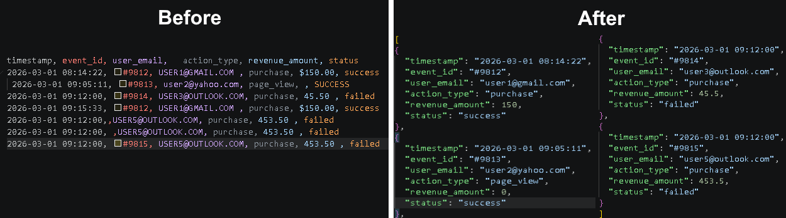

# Raw CSV to JSON Pipeline

**A high-performance Node.js stream pipeline built to automatically parse, clean, and convert raw legacy system exports into structured JSON format without memory leaks.**

---

## The Problem
Legacy corporate systems often export data that is highly unorganized and structurally flawed. When these files scale up to hundreds of megabytes, traditional office software (like Excel) crashes, and standard code scripts run out of system memory.

Common data anomalies found in these raw exports include:
*   **Inconsistent Casing:** Emails and statuses mixed with accidental `CAPSLOCK` or chaotic casing.
*   **Bad Spacing:** Aggressive leading or trailing whitespaces inside data cells.
*   **Corrupt/Empty Values:** Missing critical fields (like transaction IDs) or broken rows.
*   **Malformed Numeric Data:** Currency formats trapped inside strings with unexpected symbols (e.g., `$150.00`).
*   **Uncontrolled Duplication:** Identical records repeated multiple times due to export lag.

---

## The Solution
This tool accepts highly volatile, uncurated CSV tables and processes them line-by-line into beautifully sanitized JSON objects ready for modern databases.



### What this tool automatically cleans for you:
*   **Whitespace Sanitization:** Automatically trims accidental spaces across all headers and values.
*   **Strict Casing Normalization:** Converts emails and statuses to standard lowercase format.
*   **Robust Row Validation:** Drops broken or corrupt rows lacking a valid `event_id` to protect database integrity.
*   **Smart Type Conversion:** Strips currency symbols (`$`) and safely parses numbers, defaulting invalid entries to `0`.
*   **In-Memory De-duplication:** Filters out redundant rows using high-speed unique index checking with `Set`.

---

## Demonstrated Capabilities
Building this pipeline requires a strong grasp of backend engineering principles. The core skills proven in this project can be directly adapted to solve other critical business automation problems:

*   **Memory-Efficient Streaming:** By utilizing Node.js `fs.createReadStream` and piping it into a streaming parser, the script keeps a completely flat memory footprint (~45MB) even when handling files over **200MB+** or millions of rows.
*   **Production-Grade Architecture:** Separation of concerns between mock data generation and production data extraction.
*   **Cross-Applicable Automation Skills:** The same stream-oriented engineering logic can be used to build:
    *   High-volume log parsers (`.txt`, `.log` to Database).
    *   Automated E-commerce data feed processors.
    *   Custom ETL (Extract, Transform, Load) tools for CRM systems.

---

## How to Run & Test
Follow these quick steps to benchmark the pipeline's speed and performance on your machine.

### Prerequisites
Make sure you have [Node.js](https://nodejs.org) installed.

### 1. Setup
Clone this repository, navigate to the folder in your terminal, and install the native helper dependencies:
```bash
npm install
```

### 2. Generate Massive Test Data (>200MB)
To simulate a real-world enterprise log without needing to download massive files, run the mock generator script:
```bash
node create_raw_csv.js
```
This script writes over **2.5 million rows** of simulated data filled with intentional errors into `./data_input/raw_export.csv`.

### 3. Run the Processing Pipeline
Execute the main cleanup automation script:
```bash
node index.js
```
The console will log the pipeline speed, saving the structured result directly inside `./data_output/clean_data.json`.

---

## Project Architecture
```text
csv-to-json-parser-automation/
├── data_input/           # Destination for incoming raw CSV exports
├── data_output/          # Destination for cleaned, structured JSON outputs
├── create_raw_csv.js     # Enterprise-scale mock data engine (>2.5M rows)
├── index.js              # Core stream-processing pipeline script
├── package.json          # Dependency configuration
└── README.md             # Project documentation
```